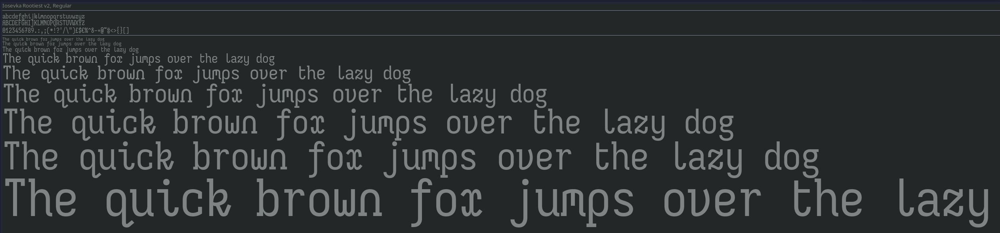

# Rootiest Iosevka Fonts

An Iosevka variant for only the rootiest of programmers.
(and anyone else who likes fancy fonts)

This font prefers fancier and curvier character varients and maximum use of ligatures.

The italic forms uses more curves and less "flags" or "tails" than the regular.

The oblique forms also introduce some alternate characters.



## Version

This font was built using
[Iosevka](https://github.com/be5invis/Iosevka) version 31.7.1

The Nerd Font patches were built using
[Nerd Fonts](https://github.com/ryanoasis/nerd-fonts) version 3.2.1

## Installation

Install all the fonts using the instructions for your operating system.

### Linux

```bash
cd ~/.local/share/fonts
git clone https://github.com/rootiest/rootiest-iosevka.git
fc-cache -fv
```

### Windows

```powershell

$home = $env:USERPROFILE
cd $home
git clone https://github.com/rootiest/rootiest-iosevka.git
cd $home\rootiest-iosevka
cp -r * $env:LOCALAPPDATA\Microsoft\Windows\Fonts
```

### MacOS

```bash
cd ~
git clone https://github.com/rootiest/rootiest-iosevka.git
cd ~/rootiest-iosevka
cp -r * ~/Library/Fonts
```

## Minimal Installation

Install only the font types you need.

Recommended base set:

- [Rootiest Iosevka V2 Font - Regular](./TTF/IosevkaRootiestV2-Regular.ttf)
- [Rootiest Iosevka V2 Font - Italic](./TTF/IosevkaRootiestV2-Italic.ttf)
- [Rootiest Iosevka V2 Font - Oblique](./TTF/IosevkaRootiestV2-Oblique.ttf)
- [Rootiest Iosevka V2 Font - Oblique Italic](./TTF/IosevkaRootiestV2-ObliqueItalic.ttf)
- [Rootiest Iosevka V2 Font - Nerd Font Patch](./NerdFont/IosevkaRootiestV2NerdFont-Regular.ttf)

## Thanks

This font wouldn't be possible without the following projects:

- [Iosevka](https://github.com/be5invis/Iosevka) -
  This is the base font whose character variants are used in this font.  
  They did all the work here, I just built it with my preferences.

- [Nerd Fonts](https://github.com/ryanoasis/nerd-fonts) -
  The Nerd Font variant is built using this patch.

## License

This font is licensed under the [MIT License](../LICENSE).

---
