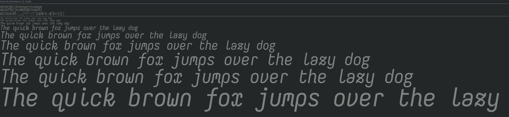
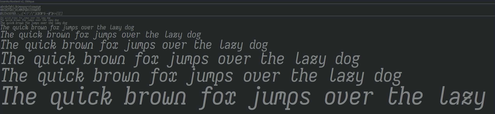

# Rootiest Iosevka Fonts

An Iosevka variant for only the rootiest of programmers.
(and anyone else who likes fancy fonts)

This font prefers fancier and curvier character variants and maximum use of ligatures.

The italic forms uses more curves and less "flags" or "tails" than the regular.

The oblique forms also introduce some alternate characters.

## Preview

**Regular:**


**Italic:**


**Oblique:**


## Version

This is Version 2.5.0 of the Rootiest Iosevka Font.

This font was built using
[Iosevka](https://github.com/be5invis/Iosevka) version 33.1.0

The Nerd Font patches were built using
[Nerd Fonts](https://github.com/ryanoasis/nerd-fonts) version 3.3.1

## Changes

New in v2.5.0:

- Updated Iosevka to version 33.1.0
- Updated Nerd Fonts to version 3.3.1.
- NerdFont-patches now include all base styles.

## Installation

Install all the fonts using the instructions for your operating system.

> [!CAUTION]
> This repository is quite large (several GB)
> and may take a while to clone and consume a lot of disk space.
> See [Minimal Installation](#manual-minimal-installation) for a smaller set.

### Linux

- Full Install:

  ```bash
  # Make the directory if it doesn't exist
  mkdir -p ~/.local/share/fonts
  # Enter the fonts directory
  cd ~/.local/share/fonts
  # Clone the repository
  git clone https://github.com/rootiest/rootiest-iosevka.git
  # Update the font cache
  fc-cache -fv
  ```

- Minimal Install:

  ```bash
  # Clone the repository
  git clone https://github.com/rootiest/rootiest-iosevka.git
  # Run the install script
  ./rootiest-iosevka/install/linux.sh --minimal
  ```

### MacOS

- Full Install:

  ```bash
  # Clone the repository
  git clone https://github.com/rootiest/rootiest-iosevka.git
  # Install the fonts
  ./rootiest-iosevka/install/mac.sh
  ```

- Minimal Install:

  ```bash
  # Clone the repository
  git clone https://github.com/rootiest/rootiest-iosevka.git
  # Run the install script
  ./rootiest-iosevka/install/mac.sh --minimal
  ```

### Windows

```powershell
Set-ExecutionPolicy RemoteSigned -Scope CurrentUser
```

1. Open **PowerShell** as Administrator:

   - Search for "PowerShell" in the Start Menu.
   - Right-click and select **Run as Administrator**.

2. Clone this repository:

   > [!TIP]
   > You can clone the repository in any directory you want.

   ```powershell
   git clone https://github.com/rootiest/rootiest-iosevka.git
   ```

3. Approve script execution:

   > [!NOTE]
   > You may need to approve script execution by running this command
   > beforehand

   ```powershell
   Set-ExecutionPolicy RemoteSigned -Scope CurrentUser
   ```

4. Run the installation script:

- Full Install:

  ```powershell
  .\rootiest-iosevka\install\windows.ps1
  ```

- Minimal Install:

  ```powershell
  .\rootiest-iosevka\install\windows.ps1 -Minimal
  ```

## Manual Minimal Installation

Download and install only the font types you need.

Recommended base set:

- [Rootiest Iosevka V2 Font - Regular](./TTF/IosevkaRootiestV2-Regular.ttf)
- [Rootiest Iosevka V2 Font - Italic](./TTF/IosevkaRootiestV2-Italic.ttf)
- [Rootiest Iosevka V2 Font - Oblique](./TTF/IosevkaRootiestV2-Oblique.ttf)
- [Rootiest Iosevka V2 Font - Oblique Italic](./TTF/IosevkaRootiestV2-ObliqueItalic.ttf)
- [Rootiest Iosevka V2 Font - Nerd Font Patch](./NerdFont/IosevkaRootiestV2NerdFont-Regular.ttf)

## Roadmap

Some proposed new changes:

- Increased uniqueness in italic form to improve its visibility alongside
  the regular and oblique forms.
- Refine the design rules for each form to standardize the curves and tails.
- More NerdFont patched forms and styles.
- Build against the latest Iosevka version.
- Build against the latest Nerd Font version.

This is a work in progress and the roadmap is subject to change.

## Thanks

This font wouldn't be possible without the following projects:

- [Iosevka](https://github.com/be5invis/Iosevka) -
  This is the base font whose character styles are used in this font.  
  They did all the work here, I just built the font with my preferences.

- [Nerd Fonts](https://github.com/ryanoasis/nerd-fonts) -
  The Nerd Font variants are built using this patch.  
  Provides a large set of glyphs and icons the font can render.

## License

This font is licensed under the [MIT License](./LICENSE).

---
